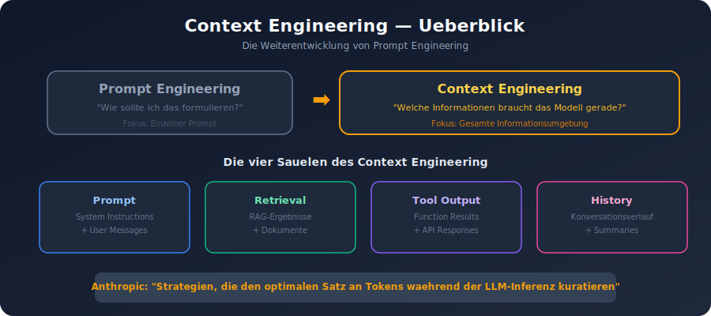
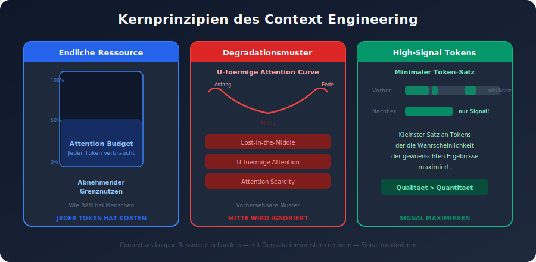
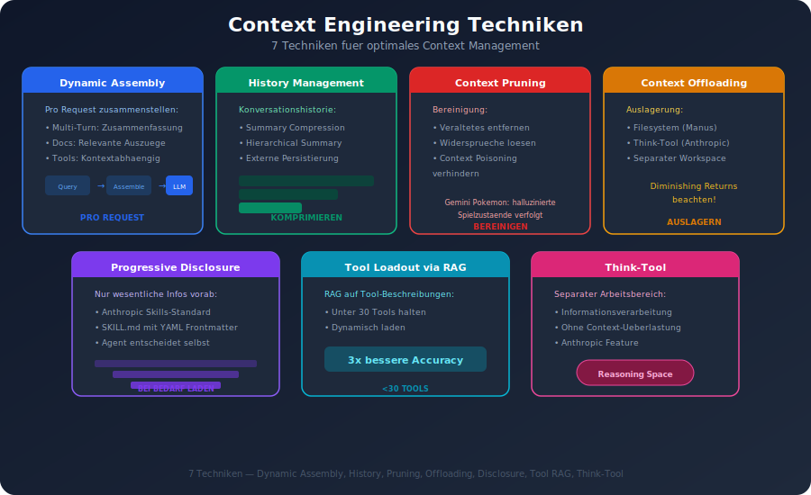
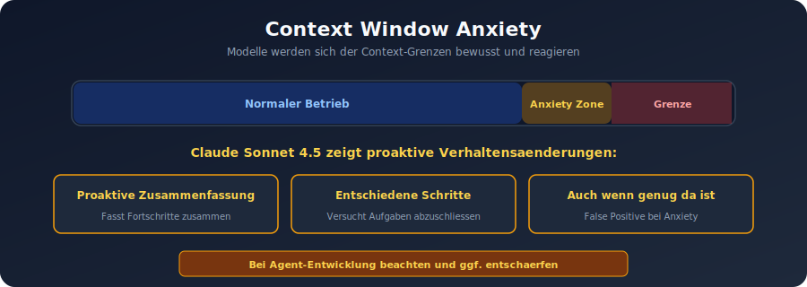
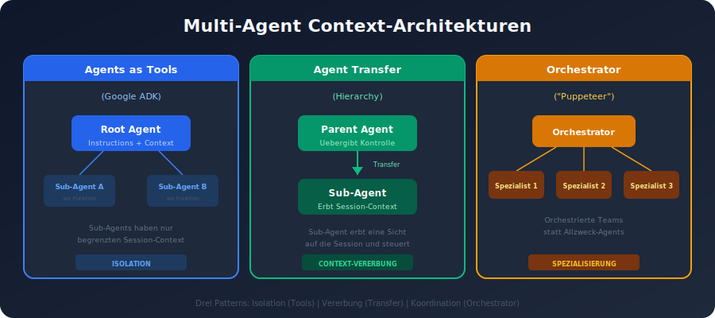
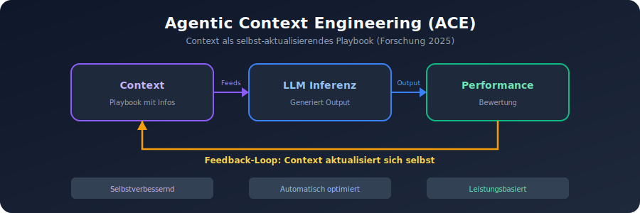
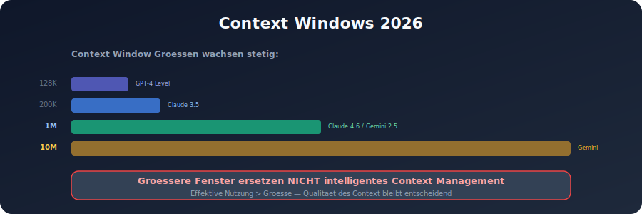
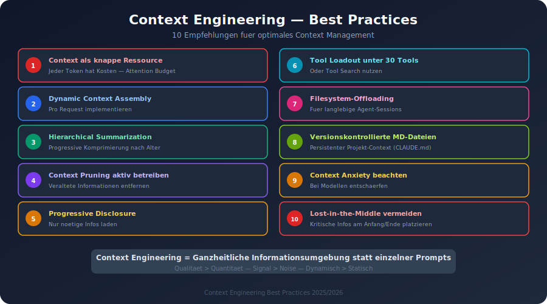

# Context Engineering und Context Management fuer AI Agents (2025/2026)

## 1. Ueberblick

Context Engineering ist die natuerliche Weiterentwicklung von Prompt Engineering. Waehrend Prompt Engineering fragt "Wie sollte ich das formulieren?", fragt Context Engineering "Welche Informationen braucht das Modell gerade Zugriff auf?". Es umfasst die Gestaltung der gesamten Informationsumgebung, die ein LLM erhaelt -- nicht nur den Prompt, sondern auch abgerufenes Wissen, Tool-Ergebnisse und Konversationshistorie.

Bei Anthropic wird Context Engineering als die Menge an Strategien definiert, die den optimalen Satz an Tokens (Informationen) waehrend der LLM-Inferenz kuratieren und pflegen.

---

## 2. Kernprinzipien

### 2.1 Context als endliche Ressource

Context muss als **endliche Ressource mit abnehmendem Grenznutzen** behandelt werden. Wie Menschen mit begrenztem Arbeitsspeicher haben LLMs ein "Attention Budget", bei dem jeder neue Token es aufbraucht.

### 2.2 Degradationsmuster bei wachsendem Context

Mit zunehmender Context-Laenge zeigen Modelle vorhersehbare Degradationsmuster:
- **Lost-in-the-Middle-Phaenomen**: Informationen in der Mitte des Context werden schlechter verarbeitet
- **U-foermige Attention Curves**: Anfang und Ende des Context erhalten mehr Aufmerksamkeit
- **Attention Scarcity**: Begrenzte Aufmerksamkeitskapazitaet wird auf zu viele Tokens verteilt

### 2.3 Minimaler High-Signal Token-Satz

Effektives Context Engineering bedeutet, den **kleinsten moeglichen Satz an High-Signal Tokens** zu finden, der die Wahrscheinlichkeit der gewuenschten Ergebnisse maximiert.

---

## 3. Context Engineering Techniken

### 3.1 Dynamic Context Assembly

Context-Assembly erfolgt pro Request. Das System kann je nach Query oder Konversationszustand unterschiedliche Informationen einbeziehen:
- Bei Multi-Turn-Konversationen: Zusammenfassung der bisherigen Konversation statt vollstaendiges Transkript
- Bei dokumentbezogenen Fragen: Relevante Auszuege aus Wikis oder Spezifikationen abrufen
- Kontextabhaengige Tool-Auswahl basierend auf dem aktuellen Schritt

### 3.2 Conversation History Management

Da das Context Window nicht unendlich ist, ist die Verwaltung der Konversationshistorie zentral:

- **Summary Compression**: Nach jedem paar Interaktionen zusammenfassen und die Zusammenfassung statt des vollstaendigen Texts weiterverwenden
- **Hierarchical Summarization**: Progressiv kompaktere Zusammenfassungen, je aelter die Information wird. Juengste Austausche bleiben woertlich, aeltere werden komprimiert.
- **Externe Persistierung**: Wichtige Fakten explizit in externen Speicher (Datei, Datenbank) schreiben und spaeter bei Bedarf abrufen

### 3.3 Context Pruning und Cleaning

- **Veraltete oder widerspruchliche Informationen entfernen**, wenn neue Details eintreffen
- **Context Poisoning verhindern**: Halluzinationen oder Fehler im Context werden wiederholt referenziert und koennen zu unsinnigen Strategien fuehren (z.B. der Gemini Pokemon-Agent, der halluzinierte Spielzustaende verfolgte)
- **Regelmaessige Context-Bereinigung** als Gegenmassnahme

### 3.4 Context Offloading

- **Filesystem-basiertes Offloading**: Alte Tool-Ergebnisse in Dateien schreiben (z.B. Manus-Ansatz)
- **Think-Tool**: Anthropics "Think"-Tool gibt Modellen einen separaten Arbeitsbereich zur Informationsverarbeitung, ohne den Haupt-Context zu ueberladen
- **Diminishing Returns beachten**: Offloading hat Grenzen, da Komprimierung zum Verlust nuetzlicher Informationen fuehren kann

### 3.5 Progressive Disclosure

Nur wesentliche Informationen vorab anzeigen und weitere Details erst bei Bedarf enthuellen:
- Anthropics Skills-Standard nutzt Progressive Disclosure
- SKILL.md-Dateien mit YAML Frontmatter werden in Agent-Instructions geladen
- Agent entscheidet selbst, ob die vollstaendige SKILL.md gelesen werden muss

### 3.6 Tool Loadout Management via RAG

RAG auf Tool-Beschreibungen anwenden:
- Forschung zeigt: Auswahl unter 30 Tools ergibt **3x bessere Tool Selection Accuracy**
- Dynamisches Laden relevanter Tools statt alle Tools gleichzeitig im Context zu halten

---

## 4. Context Window Anxiety Management

Modelle wie Claude Sonnet 4.5 zeigen "Context Anxiety" -- sie werden sich der Annaeherung an Context Window-Grenzen bewusst und:
- Fassen proaktiv Fortschritte zusammen
- Treffen entschiedene Schritte, um Aufgaben abzuschliessen
- Auch wenn noch genuegend Context vorhanden ist

Dies ist ein zu beachtendes Phaenomen bei der Agent-Entwicklung.

---

## 5. Multi-Agent Context-Architekturen

### 5.1 Agents as Tools (Google ADK)

Der Root-Agent behandelt einen spezialisierten Agent als Funktion mit spezifischen Instructions. Der Sub-Agent hat nur begrenzten Zugriff auf den Session-Context.

### 5.2 Agent Transfer (Hierarchy)

Die Kontrolle wird an einen Sub-Agent uebergeben, der eine Sicht auf die Session erbt und den Workflow steuern kann.

### 5.3 Orchestrator-Pattern

"Puppeteer"-Orchestratoren koordinieren Spezialisten-Agents. Einzelne Allzweck-Agents werden durch orchestrierte Teams spezialisierter Agents ersetzt.

---

## 6. Agentic Context Engineering (ACE)

Ein neuer Forschungsansatz (2025), bei dem sich der Context wie ein **Playbook entwickelt, das sich selbst aktualisiert** basierend auf Model-Performance-Feedback:
- Context evolves basierend auf Leistungsrueckmeldungen
- Selbstverbessernde Kontexte fuer Language Models
- Automatische Optimierung der bereitgestellten Informationen

---

## 7. Versionskontrollierte Context-Dateien

Anbieter agentischer Tools wie Claude Code empfehlen die Pflege von **versionskontrollierten Markdown-Dateien**, die Aspekte beschreiben wie:
- Projektstruktur
- Code-Stil
- Build- und Test-Anweisungen
- Konventionen und Regeln

Diese dienen als persistenter, strukturierter Context fuer Coding Agents.

---

## 8. Context Windows 2026: Aktuelle Groessen

Die Context Window-Groessen wachsen stetig:
- Aktuelle Modelle bieten 1M bis 10M Tokens
- Trotzdem bleibt die effektive Nutzung des Context (nicht nur die Groesse) der entscheidende Faktor
- Groessere Fenster ersetzen nicht intelligentes Context Management

---

## 9. Best Practices (Zusammenfassung)

1. **Context als knappe Ressource behandeln** -- jeder Token hat Kosten.
2. **Dynamic Context Assembly** pro Request implementieren.
3. **Hierarchical Summarization** fuer Konversationshistorie nutzen.
4. **Context Pruning** aktiv betreiben -- veraltete Infos entfernen.
5. **Progressive Disclosure** -- nur noetige Infos laden.
6. **Tool Loadout unter 30 Tools** halten oder Tool Search nutzen.
7. **Filesystem-Offloading** fuer langlebige Agent-Sessions.
8. **Versionskontrollierte Markdown-Dateien** fuer persistenten Projekt-Context.
9. **Context Anxiety** bei Modellen beachten und ggf. entschaerfen.
10. **Lost-in-the-Middle vermeiden** -- kritische Infos am Anfang oder Ende des Context platzieren.
