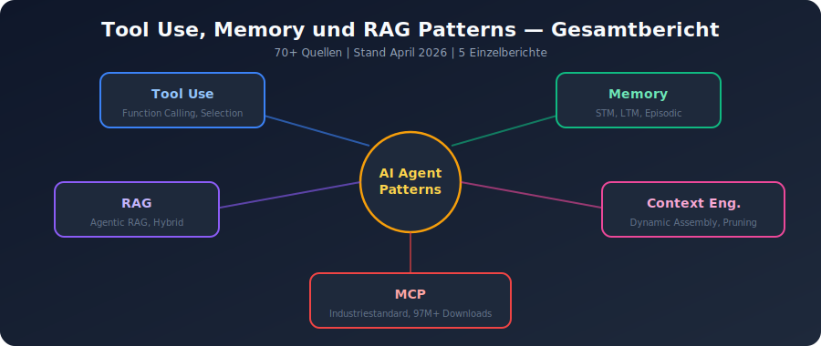
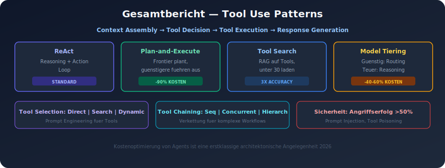
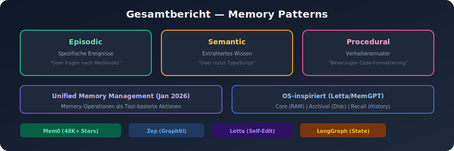
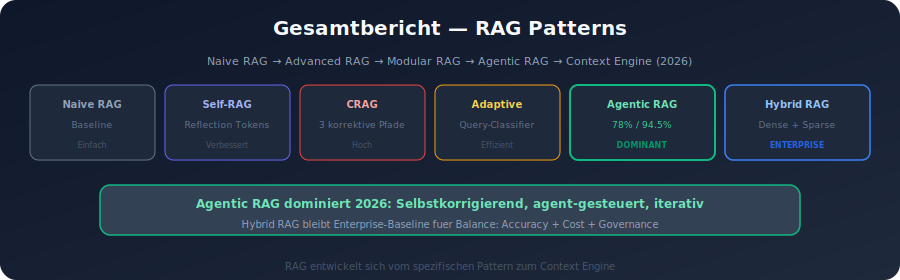
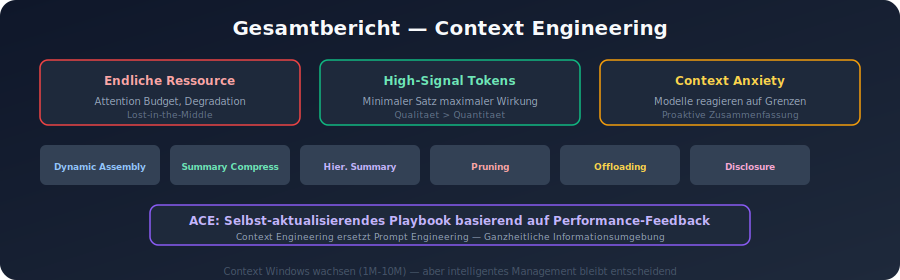
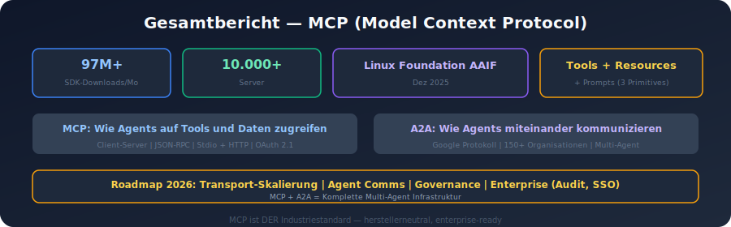
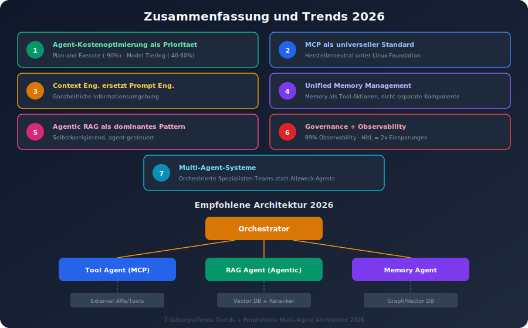

# Tool Use, Memory und RAG Patterns fuer AI Agents (2025/2026)

## Gesamtbericht

---

## Inhaltsverzeichnis

1. [Einfuehrung](#1-einfuehrung)
2. [Tool Use Patterns](#2-tool-use-patterns)
3. [Memory Patterns](#3-memory-patterns)
4. [RAG Patterns](#4-rag-patterns)
5. [Context Engineering und Context Management](#5-context-engineering-und-context-management)
6. [MCP (Model Context Protocol)](#6-mcp-model-context-protocol)
7. [Zusammenfassung und Trends 2026](#7-zusammenfassung-und-trends-2026)

---

## 1. Einfuehrung



Dieses Dokument fasst die aktuellen Erkenntnisse zu Tool Use, Memory und RAG Patterns fuer AI Agents zusammen, basierend auf einer umfassenden Recherche von ueber 70 Quellen (Stand: April 2026). Die detaillierten Einzelberichte befinden sich in separaten Dateien:

- `tool_use_patterns.md` -- Function Calling, Tool Selection, Tool Chaining
- `memory_patterns.md` -- Short-term, Long-term, Episodic, Semantic, Procedural Memory
- `rag_patterns.md` -- RAG-Varianten und Agentic RAG
- `context_engineering.md` -- Context Management und Engineering
- `mcp_patterns.md` -- Model Context Protocol
- `_quellen.md` -- Alle verwendeten Quellen

---

## 2. Tool Use Patterns



### 2.1 Function Calling als Kernfaehigkeit

Function Calling (auch Tool Calling) ist die Grundlage moderner AI Agents. Der Workflow folgt einem vierstufigen Prozess: **Context Assembly -> Tool Decision -> Tool Execution -> Response Generation**. Das LLM entscheidet autonom, ob und welches Tool aufgerufen wird, basierend auf den Tool-Beschreibungen und dem aktuellen Context.

### 2.2 Zentrale Design Patterns

| Pattern | Beschreibung | Kostenreduktion |
|---------|-------------|-----------------|
| **ReAct** | Reasoning -> Action -> Observation Loop | Standard |
| **Plan-and-Execute** | Frontier-Modell plant, guenstigere Modelle fuehren aus | Bis zu 90% |
| **Tool Search** | RAG auf Tool-Beschreibungen, unter 30 Tools | 3x bessere Accuracy |
| **Model Tiering** | Guenstiges Modell fuer Routing, teures fuer Reasoning | 40-60% |

### 2.3 Tool Selection

- **Direkte Auswahl**: LLM waehlt basierend auf Tool-Beschreibungen (Prompt Engineering fuer Tools)
- **Tool Search Pattern**: Bei grossen Tool-Sets zuerst suchen, dann laden
- **Dynamic Tool Routing**: Runtime-Entscheidung fuer das beste Tool/Modell

### 2.4 Tool Chaining

- **Sequential**: Lineare Verkettung, Output wird zum naechsten Input
- **Concurrent**: Parallele Ausfuehrung durch spezialisierte Agents
- **Hierarchical**: Manager-Agent delegiert an Unter-Agents

### 2.5 Sicherheit

Function Calling birgt erhebliche Risiken (Angriffserfolgsraten >50%): Prompt Injection, Tool Poisoning, Renaming Attacks. Semantischer Drift bei Paraphrasierung fuehrt zu 11-19% Performance-Rueckgang.

---

## 3. Memory Patterns



### 3.1 Memory-Typen (Standard 2026)

Drei Memory-Scopes haben sich als Standard etabliert:

| Typ | Beschreibung | Beispiel |
|-----|-------------|---------|
| **Episodic** | Spezifische vergangene Interaktionen mit Zeitstempeln | "User fragte nach Webhook-Docs" |
| **Semantic** | Extrahiertes Wissen ohne Ereignis-Context | "User programmiert in TypeScript" |
| **Procedural** | Erlernte Verhaltensmuster | Bevorzugte Code-Formatierung |

Zusaetzlich die klassische Unterscheidung:
- **Short-Term Memory (In-Context)**: Live Context Window, brutal endlich
- **Long-Term Memory (Out-of-Context)**: Externer Speicher (Vector/Graph DB)

### 3.2 Architektur-Patterns

**Unified Memory Management (2026)**: Memory-Operationen werden als Tool-basierte Aktionen exponiert. Agents entscheiden autonom ueber Speichern, Abrufen, Aktualisieren, Zusammenfassen und Verwerfen.

**OS-inspirierte Architektur (Letta/MemGPT)**: Drei-Tier-Modell:
1. Core Memory (immer im Context, wie RAM)
2. Archival Memory (Vector Store, wie Disk)
3. Recall Memory (Konversationshistorie)

Virtual Context Management verschiebt Daten zwischen "Virtual Context" (alle Daten) und "Physical Context" (tatsaechliches Window).

### 3.3 Fuehrende Frameworks 2026

| Framework | Staerke | Architektur |
|-----------|---------|-------------|
| **Mem0** | Ausgereifteste LTM-Loesung, 48K+ Stars | Universal Memory Layer |
| **Zep** | Langfristige Sessions | Temporal Knowledge Graph (Graphiti) |
| **Letta** | Self-Editing Memory | OS-inspiriert, Virtual Context |
| **LangGraph** | Stateful Multi-Agent | Graph-basiert, explizites State Management |

### 3.4 Hierarchical Summarization

Zentrales Pattern: Aeltere Konversationssegmente werden progressiv komprimiert. Juengste Austausche bleiben woertlich, aeltere werden in Zusammenfassungsform uebergefuehrt.

---

## 4. RAG Patterns



### 4.1 Evolution von RAG

RAG hat sich von einer einfachen Retrieve-Generate-Pipeline zu einem **Context Engine** entwickelt:

```
Naive RAG -> Advanced RAG -> Modular RAG -> Agentic RAG -> Context Engine (2026)
```

### 4.2 RAG-Varianten im Ueberblick

| Variante | Kernmerkmal | Performance |
|----------|------------|-------------|
| **Naive RAG** | Einfache Pipeline | Baseline |
| **Self-RAG** | Reflection Tokens zur Selbst-Bewertung | Verbessert |
| **Corrective RAG** | Externer Evaluator, 3 korrektive Pfade | Hoch |
| **Adaptive RAG** | Classifier fuer Query-Komplexitaet | Effizient |
| **Agentic RAG** | Agent-gesteuert, selbstkorrigierend | 78% / 94.5% HotpotQA |
| **Hybrid RAG** | Dense + Sparse Retrieval | Enterprise Baseline |
| **Graph RAG** | Knowledge Graphs | Bei Beziehungs-Fragen |

### 4.3 Agentic RAG im Detail

Dominantes Pattern 2026 mit Agent-Controlled Retrieval Loop:
1. Query Analysis und Decomposition in Sub-Queries
2. Parallele Ausfuehrung der Sub-Queries
3. Result Grading auf Relevanz
4. Self-Correction bei ungenuegenden Ergebnissen
5. Synthesis zu strukturierten Antworten

### 4.4 Enterprise RAG

- **Hybrid RAG** als Produktions-Baseline (Balance: Accuracy, Cost, Governance)
- Governance-Pflicht: Access Controls und Metadata vor Retrieval
- Trend zu **Knowledge Runtimes** als integrierte Plattformen

---

## 5. Context Engineering und Context Management



### 5.1 Definition

Context Engineering ist die Weiterentwicklung von Prompt Engineering. Es umfasst die Gestaltung der **gesamten Informationsumgebung** eines LLM -- nicht nur den Prompt, sondern auch Retrieval-Ergebnisse, Tool-Outputs und Konversationshistorie.

### 5.2 Kernprinzipien

- **Context als endliche Ressource**: Jeder Token hat Kosten (Attention Budget)
- **Degradationsmuster**: Lost-in-the-Middle, U-foermige Attention, Attention Scarcity
- **Minimaler High-Signal Token-Satz**: Kleinste Menge an Tokens fuer maximalen Effekt

### 5.3 Zentrale Techniken

| Technik | Beschreibung |
|---------|-------------|
| **Dynamic Context Assembly** | Pro-Request Context-Zusammenstellung |
| **Summary Compression** | Periodische Zusammenfassung der Historie |
| **Hierarchical Summarization** | Progressive Komprimierung nach Alter |
| **Context Pruning** | Entfernung veralteter/widerspruchlicher Infos |
| **Context Offloading** | Filesystem-basierte Auslagerung (Manus-Ansatz) |
| **Progressive Disclosure** | Nur noetige Infos laden (Anthropic Skills) |
| **Tool Loadout via RAG** | RAG auf Tool-Beschreibungen, <30 Tools |
| **Think-Tool** | Separater Arbeitsbereich fuer Reasoning |

### 5.4 Context Window Anxiety

Modelle wie Claude Sonnet 4.5 zeigen "Context Anxiety" -- sie werden sich der Context-Grenzen bewusst und handeln proaktiv (Zusammenfassungen, Aufgabenabschluss), auch wenn noch genuegend Context vorhanden ist.

### 5.5 Agentic Context Engineering (ACE)

Neuer Forschungsansatz: Context entwickelt sich wie ein **selbst-aktualisierendes Playbook** basierend auf Model-Performance-Feedback.

### 5.6 Versionskontrollierte Context-Dateien

Best Practice fuer Coding Agents: Markdown-Dateien im Repository pflegen (z.B. CLAUDE.md), die Projektstruktur, Code-Stil und Konventionen beschreiben.

---

## 6. MCP (Model Context Protocol)



### 6.1 Status 2026

MCP ist der **Industriestandard** fuer die Verbindung von LLMs mit externen Tools und Daten:
- 97M+ monatliche SDK-Downloads, 10.000+ aktive Server
- Unterstuetzt in Claude, ChatGPT, Cursor, Gemini, VS Code, Microsoft Copilot
- Seit Dezember 2025 unter der Linux Foundation (Agentic AI Foundation)

### 6.2 Architektur

**Client-Server-Modell** mit JSON-RPC:
- Drei Core Primitives: **Tools** (Aktionen), **Resources** (Daten), **Prompts** (Templates)
- Transport: Stdio (lokal) und Streamable HTTP (remote)
- Discovery: Client fragt Server nach Faehigkeiten, registriert diese

### 6.3 Spezifikation November 2025

Erweitert MCP ueber synchrones Tool Calling hinaus:
- Asynchrone Operationen fuer lang laufende Tasks
- OAuth 2.1 Autorisierung
- Community Registry fuer Server-Discovery
- Server Identity und Statelessness

### 6.4 Roadmap 2026

| Prioritaet | Fokus |
|-----------|-------|
| **Transport** | Horizontale Skalierung, `.well-known` Discovery |
| **Agent Communication** | Tasks Primitive, Retry-Semantiken |
| **Governance** | Working Groups, Contributor Ladder |
| **Enterprise** | Audit Trails, SSO, Gateway, Config Portability |

### 6.5 MCP + A2A

- **MCP**: Wie Agents auf Tools und Daten zugreifen
- **A2A** (Google): Wie Agents miteinander kommunizieren (150+ Organisationen)
- Zusammen bilden sie die Infrastruktur fuer Multi-Agent-Systeme

---

## 7. Zusammenfassung und Trends 2026



### 7.1 Uebergreifende Trends

1. **Agent-Kostenoptimierung als Architektur-Prioritaet**: Plan-and-Execute (-90%), Model Tiering (-40-60%)
2. **MCP als universeller Standard**: Herstellerneutral unter Linux Foundation
3. **Context Engineering ersetzt Prompt Engineering**: Ganzheitliche Informationsumgebung statt einzelner Prompts
4. **Unified Memory Management**: Memory als Tool-Aktionen, nicht als separate Komponente
5. **Agentic RAG als dominantes Pattern**: Selbstkorrigierende, agent-gesteuerte Retrieval-Systeme
6. **Governance und Observability**: 89% haben Observability implementiert; Human-in-the-Loop verdoppelt Kosteneinsparungen
7. **Multi-Agent-Systeme**: Orchestrierte Spezialisten-Teams statt Allzweck-Agents

### 7.2 Architektur-Empfehlungen

```
                    +------------------+
                    |   Orchestrator   |
                    +--------+---------+
                             |
            +----------------+----------------+
            |                |                |
    +-------+------+  +-----+------+  +------+------+
    | Tool Agent   |  | RAG Agent  |  | Memory Agent|
    | (MCP Tools)  |  | (Agentic   |  | (Mem0/Zep/  |
    |              |  |  RAG)      |  |  Letta)     |
    +--------------+  +------------+  +-------------+
            |                |                |
    +-------+------+  +-----+------+  +------+------+
    | External     |  | Vector DB  |  | Graph DB /  |
    | APIs/Tools   |  | + Reranker |  | Vector DB   |
    +--------------+  +------------+  +-------------+
```

### 7.3 Zentrale Best Practices

1. **Tool-Beschreibungen wie Prompts behandeln** -- sie bestimmen die Tool Selection Accuracy
2. **Memory als drei Scopes implementieren**: Episodic, Semantic, Procedural
3. **Hybrid RAG als Enterprise-Baseline** verwenden, Agentic RAG fuer Komplexitaet
4. **Context als knappe Ressource** behandeln -- jeder Token kostet Attention
5. **MCP fuer Tool-Integration** nutzen, A2A fuer Agent-Kommunikation
6. **Hierarchical Summarization** fuer Konversationshistorie
7. **Governance vor Retrieval** sicherstellen
8. **Observability als Grundanforderung** implementieren
9. **Model Tiering** fuer Kosteneffizienz einsetzen
10. **Versionskontrollierte Context-Dateien** im Repository pflegen

---

*Erstellt am 2026-04-04 | Detaillierte Einzelberichte in den jeweiligen Dateien | Alle Quellen in `_quellen.md`*
