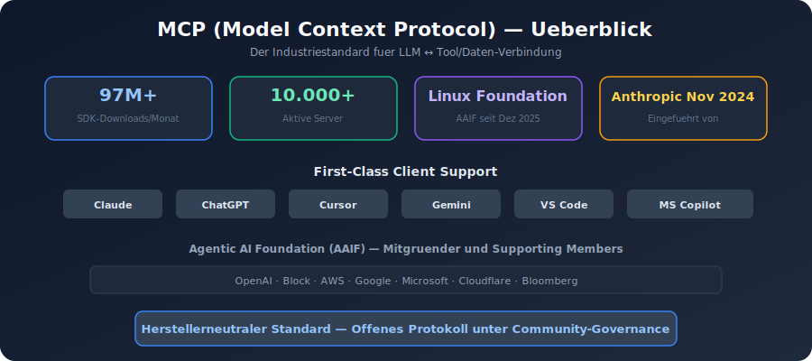
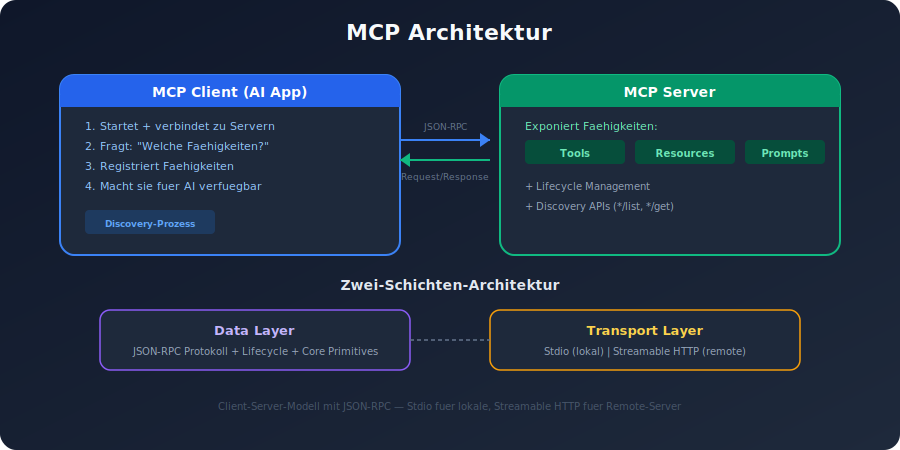
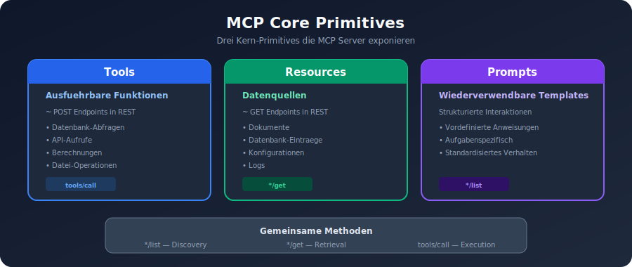
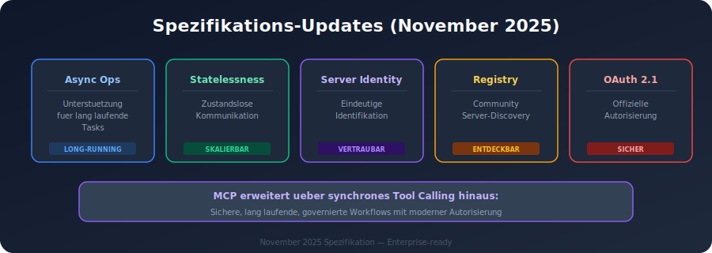
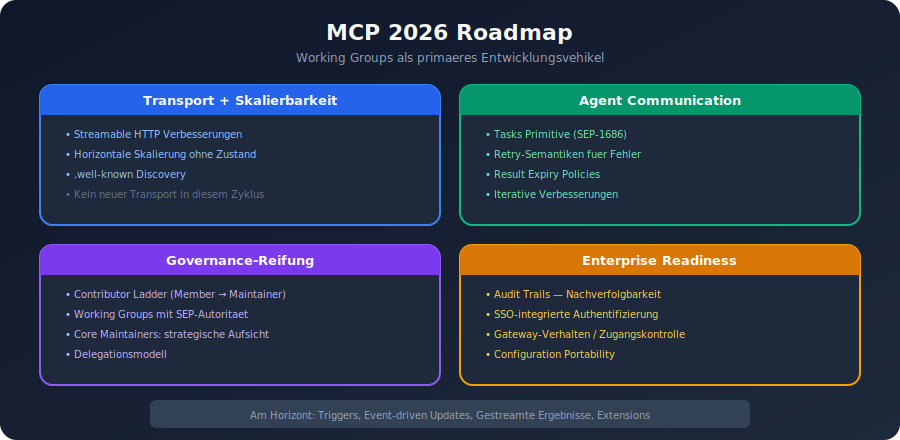
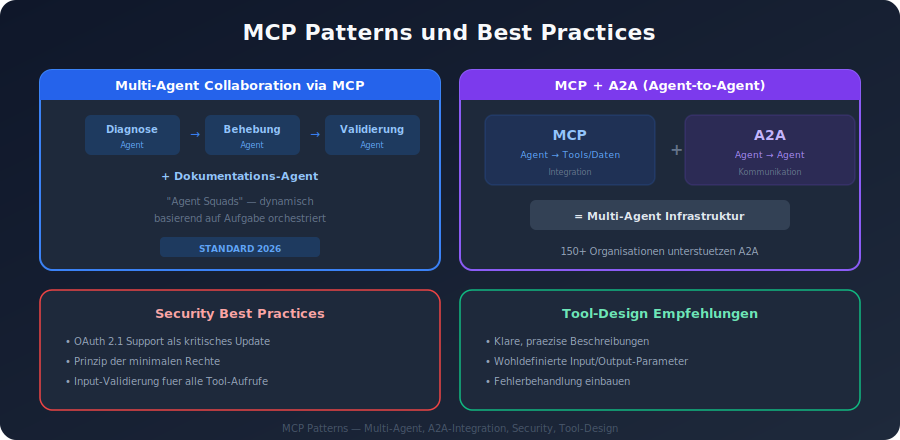
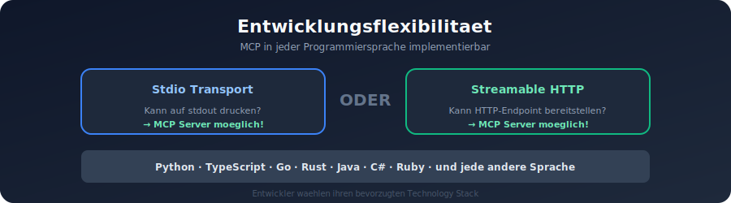
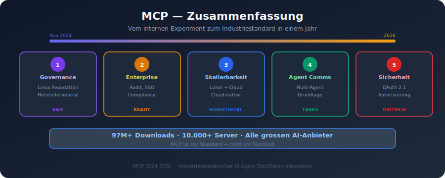

# MCP (Model Context Protocol) Patterns (2025/2026)

## 1. Ueberblick

Das Model Context Protocol (MCP) ist ein offener Standard, der von Anthropic im November 2024 eingefuehrt wurde und definiert, wie LLMs sich mit externen Tools und Datenquellen verbinden. MCP hat sich zum **Industriestandard** entwickelt mit:

- **97 Millionen monatliche SDK-Downloads**
- **10.000+ aktive Server**
- First-Class Client Support in Claude, ChatGPT, Cursor, Gemini, Microsoft Copilot und VS Code
- Im Dezember 2025 wurde MCP an die **Agentic AI Foundation (AAIF)** unter der Linux Foundation gespendet
- OpenAI und Block sind Mitgruender, AWS, Google, Microsoft, Cloudflare und Bloomberg sind Supporting Members

---

## 2. Architektur

### 2.1 Client-Server-Modell

MCP basiert auf einem Client-Server-Modell mit JSON-RPC-basiertem Protokoll:

- **Data Layer**: Definiert das JSON-RPC-basierte Protokoll fuer Client-Server-Kommunikation, einschliesslich Lifecycle Management und Core Primitives
- **Transport Layer**: Definiert die Kommunikationsmechanismen und -kanaele fuer den Datenaustausch

### 2.2 Transport-Mechanismen

1. **Stdio Transport**: Standard Input/Output Streams fuer direkte Prozesskommunikation zwischen lokalen Prozessen -- optimale Performance ohne Netzwerk-Overhead
2. **Streamable HTTP** (neu): Ermoeglicht MCP Servers als Remote Services statt lokaler Prozesse. Bringt aber Herausforderungen mit stateful Sessions und Load Balancern.

### 2.3 Discovery-Prozess

1. MCP Client startet und verbindet sich mit konfigurierten MCP Servern
2. Client fragt jeden Server: "Welche Faehigkeiten bietest du an?"
3. Jeder Server antwortet mit verfuegbaren Tools, Resources und Prompts
4. Client registriert diese Faehigkeiten und macht sie fuer die AI verfuegbar

---

## 3. Core Primitives

MCP definiert drei Kern-Primitives, die Server exponieren koennen:

### 3.1 Tools

- **Ausfuehrbare Funktionen**, die AI-Anwendungen aufrufen koennen, um Aktionen durchzufuehren
- Vergleichbar mit POST-Endpoints in REST APIs
- Beispiele: Datenbank-Abfragen, API-Aufrufe, Berechnungen, Datei-Operationen

### 3.2 Resources

- **Datenquellen**, die kontextuelle Informationen bereitstellen
- Vergleichbar mit GET-Endpoints in REST APIs
- Beispiele: Dokumente, Datenbank-Eintraege, Konfigurationen, Logs

### 3.3 Prompts

- **Wiederverwendbare Templates**, die die Strukturierung von Interaktionen mit Language Models unterstuetzen
- Vordefinierte Anweisungssaetze fuer bestimmte Aufgaben
- Helfen bei der Standardisierung von Agent-Verhalten

### 3.4 Associated Methods

Jeder Primitive-Typ hat zugehoerige Methoden:
- **Discovery**: `*/list` -- verfuegbare Primitives auflisten
- **Retrieval**: `*/get` -- spezifisches Primitive abrufen
- **Execution**: `tools/call` -- Tool ausfuehren (nur fuer Tools)

---

## 4. Spezifikations-Updates (November 2025)

Die November 2025-Spezifikation brachte wesentliche Erweiterungen:

- **Asynchrone Operationen**: Unterstuetzung fuer lang laufende Tasks
- **Statelessness**: Verbesserungen fuer zustandslose Kommunikation
- **Server Identity**: Eindeutige Identifikation von MCP Servern
- **Community Registry**: Offizielles, Community-getriebenes Registry fuer die Entdeckung von MCP Servern
- **OAuth 2.1 Authorization**: Offizielle Spezifikation (Juni 2025 veroeffentlicht)

Die Spezifikation erweitert MCP ueber synchrones Tool Calling hinaus zu einer Architektur fuer **sichere, lang laufende, governierte Workflows** mit moderner Autorisierung und Enterprise-Anforderungen.

---

## 5. MCP 2026 Roadmap

Die Roadmap wechselt von Release-basierter Planung zu **Working Groups als primaeres Entwicklungsvehikel**.

### 5.1 Transport Evolution und Skalierbarkeit

- Verbesserungen an Streamable HTTP Transport
- **Horizontale Skalierung** ohne Zustandshaltung
- Metadata Discovery via `.well-known` Standard-Format
- Kein neuer offizieller Transport in diesem Zyklus

### 5.2 Agent Communication

- Aufbau auf dem **Tasks Primitive** (SEP-1686)
- Retry-Semantiken fuer transiente Fehler
- Result Expiry Policies nach Task-Abschluss
- Iterative Verbesserungen basierend auf Praxis-Feedback

### 5.3 Governance-Reifung

- Dokumentierte Contributor Ladder (Community Member -> Maintainer)
- Delegationsmodell: Working Groups erhalten domaenenspezifische SEP-Autoritaet
- Core Maintainers behalten strategische Aufsicht

### 5.4 Enterprise Readiness

- **Audit Trails**: Nachverfolgbarkeit aller Agent-Aktionen
- **SSO-integrierte Authentifizierung**
- **Gateway-Verhalten**: Standardisierte Zugangskontrolle
- **Configuration Portability**: Uebertragbare Konfigurationen
- Erwartet als Extensions, nicht als Core-Spec-Aenderungen

### 5.5 Am Horizont (Community-Driven)

- Triggers und Event-driven Updates
- Gestreamte Ergebnisse
- Erweiterte Sicherheitsarbeit
- Extensions-Oekosystem-Reifung

---

## 6. MCP Patterns und Best Practices

### 6.1 Tool-Design

- **Klare, praezise Beschreibungen** fuer jedes Tool (Prompt Engineering fuer Tools)
- **Wohldefinierte Input/Output-Parameter** mit Beschreibungen
- **Fehlerbehandlung** in Tool-Implementierungen einbauen

### 6.2 Multi-Agent Collaboration via MCP

Der Standard fuer 2026: Multi-Agent Collaboration, bei der:
- Ein Agent diagnostiziert
- Ein anderer behebt
- Ein dritter validiert
- Ein vierter dokumentiert
- Diese "Agent Squads" werden dynamisch basierend auf der Aufgabe orchestriert

### 6.3 MCP + A2A (Agent-to-Agent)

- MCP loest die **Tool- und Datenintegration** (wie Agents auf Tools zugreifen)
- A2A (Googles Protokoll) loest die **Agent-zu-Agent-Kommunikation** (wie Agents miteinander sprechen)
- Zusammen bilden sie die Infrastruktur fuer Multi-Agent-Systeme

### 6.4 Security Best Practices

Fruehe MCP-Implementierungen hatten Sicherheitsluecken:
- Viele Implementierungen standardmaessig ohne Authentifizierung
- OAuth 2.1 Support als kritisches Update
- **Prinzip der minimalen Rechte** fuer Tool-Zugriffe
- **Input-Validierung** fuer alle Tool-Aufrufe

---

## 7. Entwicklungsflexibilitaet

MCP kann in **jeder Programmiersprache** implementiert werden, die:
- Auf stdout drucken kann (fuer Stdio Transport)
- Einen HTTP-Endpoint bereitstellen kann (fuer Streamable HTTP)

Entwickler koennen ihren bevorzugten Technology Stack waehlen.

---

## 8. Zusammenfassung

MCP hat sich innerhalb eines Jahres vom internen Experiment zum Industriestandard entwickelt. Die wichtigsten Entwicklungen 2026:

1. **Governance unter Linux Foundation** -- herstellerneutrale Weiterentwicklung
2. **Enterprise-Fokus** -- Audit, SSO, Compliance
3. **Skalierbarkeit** -- von lokalen Prozessen zu Cloud-nativen Services
4. **Agent Communication** -- Grundlage fuer Multi-Agent-Systeme
5. **Sicherheit** -- OAuth 2.1 und erweiterte Autorisierung
