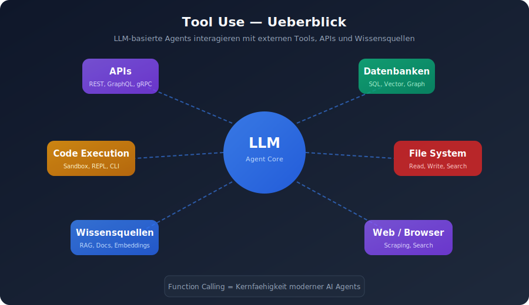
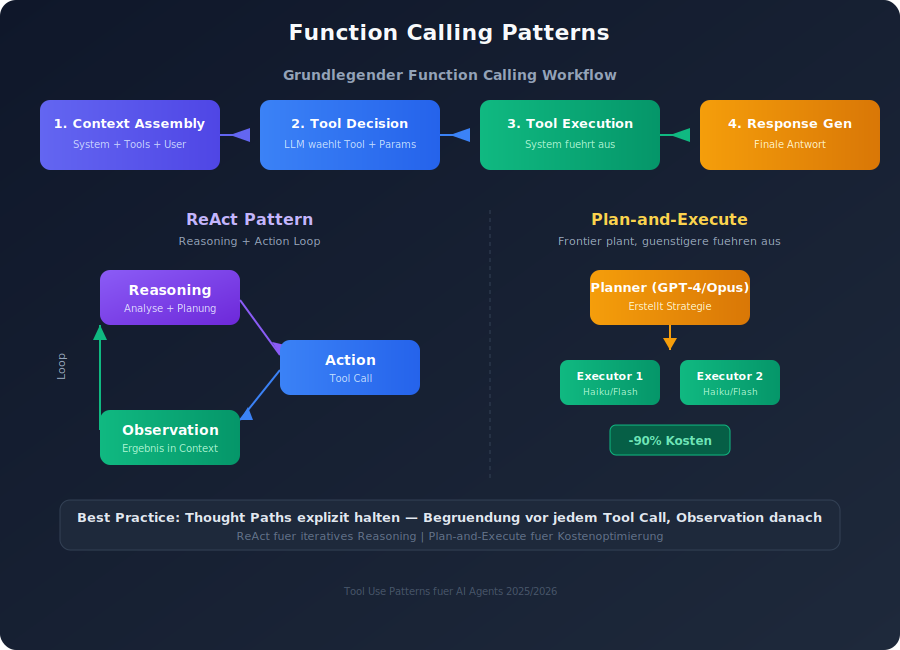
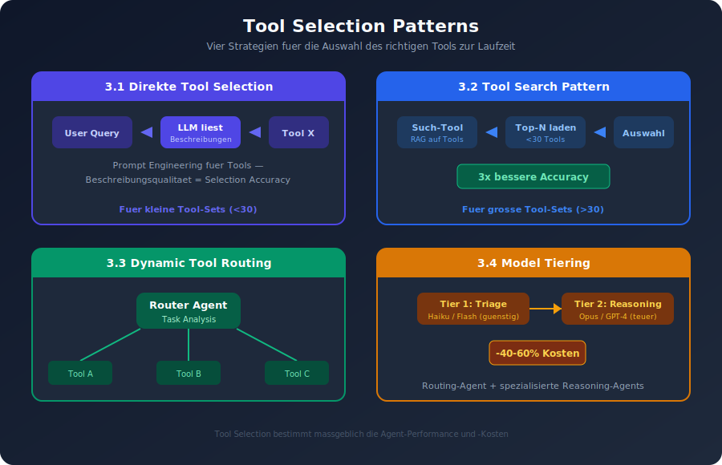
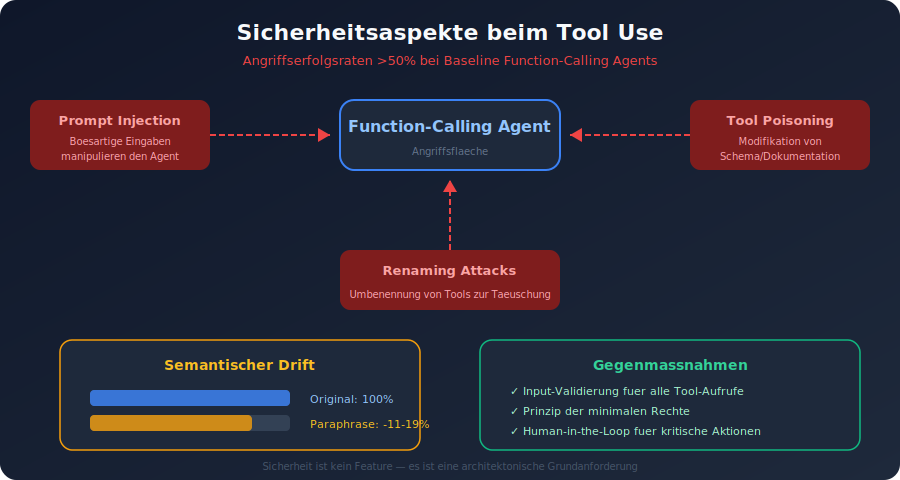
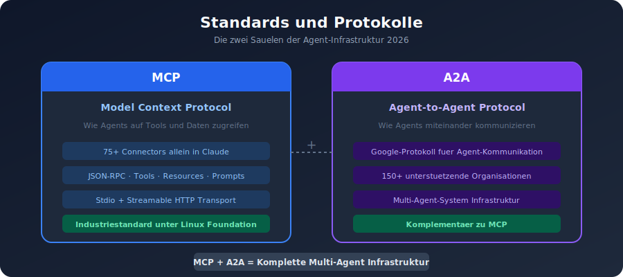
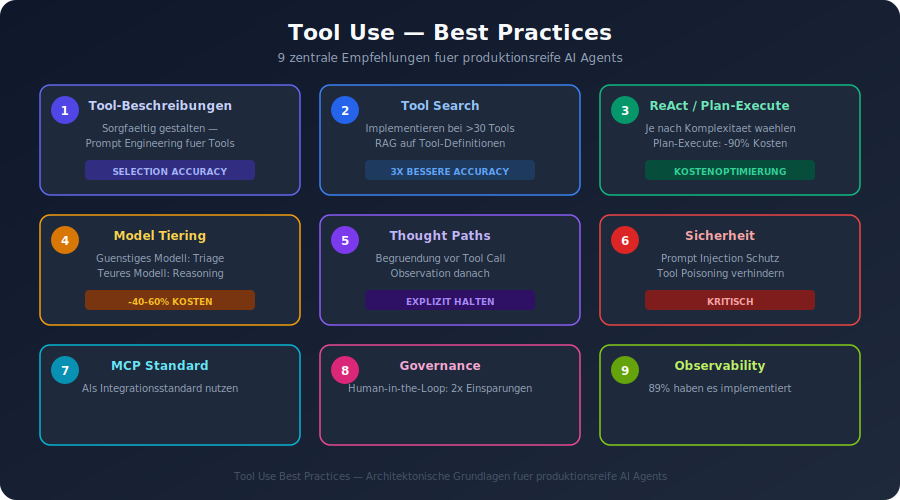

# Tool Use Patterns fuer AI Agents (2025/2026)

## 1. Ueberblick

Tool Use (auch Function Calling genannt) ist eine der Kernfaehigkeiten moderner LLM-basierter Agents. Es ermoeglicht LLMs die Interaktion mit externen Tools, APIs und Wissensquellen. Wenn ein LLM eine Anfrage erhaelt, die Informationen oder Aktionen jenseits seiner Trainingsdaten erfordert, kann es entscheiden, eine externe Funktion aufzurufen.

---

## 2. Function Calling Patterns

### 2.1 Grundlegender Function Calling Workflow

Der Prozess besteht aus mehreren Schritten:

1. **Context Assembly**: System Messages, Tool-Definitionen und User-Nachrichten werden kombiniert und bilden den vollstaendigen Context, der an das Modell gesendet wird.
2. **Tool Decision**: Das LLM analysiert den Context und entscheidet, ob es ein Tool aufrufen muss. Es gibt eine strukturierte Antwort aus, die angibt, welches Tool mit welchen Parametern aufgerufen werden soll.
3. **Tool Execution**: Das System fuehrt den Tool-Aufruf aus und gibt das Ergebnis zurueck.
4. **Response Generation**: Das LLM verarbeitet das Tool-Ergebnis und generiert die finale Antwort.

### 2.2 ReAct Pattern (Reasoning + Action)

Das ReAct Pattern folgt einer **Reasoning -> Action -> Observation**-Schleife:

- **Reasoning**: Das LLM analysiert die aktuelle Situation und plant den naechsten Schritt.
- **Action**: Das LLM waehlt ein Tool aus und ruft es auf.
- **Observation**: Das Ergebnis wird zurueck in den Context eingefuegt.
- **Wiederholung**: Der Zyklus wiederholt sich, bis die Aufgabe abgeschlossen ist.

Best Practice: Thought Paths explizit halten -- vor jedem Tool Call eine einzeilige Begruendung und die gewaehlte Tool-ID verlangen, nach dem Call eine kurze Observation.

### 2.3 Plan-and-Execute Pattern

Ein leistungsfaehiges Modell erstellt eine Strategie, die guenstigere Modelle ausfuehren. Dieses Pattern kann **Kosten um bis zu 90%** reduzieren im Vergleich zur Nutzung von Frontier-Modellen fuer alles. Im Jahr 2026 wird die Kostenoptimierung von Agents als erstklassige architektonische Angelegenheit behandelt, aehnlich wie Cloud-Kostenoptimierung in der Microservices-Aera.

---

## 3. Tool Selection Patterns

### 3.1 Direkte Tool Selection

Das LLM waehlt basierend auf den Tool-Beschreibungen direkt das passende Tool aus. Die Qualitaet der Funktionsbeschreibungen bestimmt direkt, wie zuverlaessig das LLM die richtige Funktion auswaehlt -- dies ist im Wesentlichen **Prompt Engineering fuer Tools**.

### 3.2 Tool Search Pattern (fuer grosse Tool-Sets)

Modelle degradieren bei zu vielen Tools. Fuer grosse Tool-Sets wird empfohlen, ein **Tool Search Pattern** zu implementieren:

1. Das Modell ruft zuerst ein Such-Tool auf, um relevante Tools zu finden.
2. Die gefundenen Tools werden dann fuer die eigentliche Nutzung geladen.

Forschung zeigt, dass RAG auf Tool-Beschreibungen angewendet und die Auswahl auf unter 30 Tools begrenzt eine **3x bessere Tool Selection Accuracy** ergibt.

### 3.3 Dynamic Tool Routing

Tool-Routing (dynamische Tool-Auswahl) laesst einen Agent zur Laufzeit das beste Tool oder Modell waehlen. Der Agent analysiert den Task-Context und ruft dann das passendste Tool fuer diesen Schritt auf.

### 3.4 Model Tiering

Ein gaengiges Produktionsmuster ist Model Tiering: ein schnelles, guenstiges Modell fuer Triage und Routing-Agents und ein leistungsfaehigeres Modell fuer komplexe Reasoning-Agents. Dies reduziert die Kosten um **40-60%** gegenueber der Nutzung eines einzigen Premium-Modells.

---

## 4. Tool Chaining Patterns

### 4.1 Sequential Chaining

Agents werden in einer vordefinierten, linearen Reihenfolge verkettet, wobei jeder Agent die Ausgabe des vorherigen Agents verarbeitet.

### 4.2 Concurrent Execution

Mehrere AI Agents werden gleichzeitig auf dieselbe Aufgabe angesetzt, wobei jeder Agent eine unabhaengige Analyse aus seiner einzigartigen Perspektive oder Spezialisierung liefert.

### 4.3 Hierarchical Task Decomposition

Eine mehrstufige "Befehlskette" von AI Agents, bei der ein Top-Level Manager-Agent Ziele setzt und an untergeordnete Agents delegiert.

---

## 5. Sicherheitsaspekte beim Tool Use

Function Calling birgt erhebliche Sicherheitsrisiken:

- **Direct Prompt Injection**: Boesartige Eingaben, die den Agent manipulieren.
- **Tool Poisoning**: Modifikation von Schema/Dokumentation eines Tools.
- **Renaming Attacks**: Umbenennung von Tools, um den Agent zu taeuschen.
- **Angriffserfolgsraten** ueberschreiten 50% bei Baseline Function-Calling Agents.

### Robustheitsprobleme

Function-Calling Agents sind anfaellig fuer **semantischen Drift** unter Paraphrasierung oder Toolkit-Erweiterung. Empirische Evaluierungen zeigen einen **Rueckgang von 11-19 Prozentpunkten** in AST Match Rates bei Paraphrase-Stoerungen.

---

## 6. Standards und Protokolle

### 6.1 Model Context Protocol (MCP)

MCP ist der gewinnende Standard fuer die Tool- und Datenintegrationsschicht. Es ist jetzt die Standardmethode, wie LLMs sich mit externen Tools und Datenquellen verbinden -- mit ueber 75 Connectors allein in Claude.

### 6.2 Agent-to-Agent Protocol (A2A)

Googles A2A-Protokoll loest das Problem, wie Agents miteinander kommunizieren, mit jetzt ueber 150 unterstuetzenden Organisationen.

---

## 7. Best Practices (Zusammenfassung)

1. **Tool-Beschreibungen sorgfaeltig gestalten** -- sie sind das Prompt Engineering fuer Tools.
2. **Tool Search implementieren** bei mehr als 30 Tools.
3. **ReAct oder Plan-and-Execute** je nach Komplexitaet waehlen.
4. **Model Tiering einsetzen** fuer Kostenoptimierung.
5. **Thought Paths explizit halten** -- Begruendung vor und Observation nach jedem Tool Call.
6. **Sicherheitsmassnahmen** gegen Prompt Injection und Tool Poisoning implementieren.
7. **MCP als Integrationsstandard** nutzen.
8. **Governance und Auditierbarkeit** einplanen -- Agents mit Human-in-the-Loop sind doppelt so wahrscheinlich, Kosteneinsparungen von 75%+ zu erzielen.
9. **Observability** als Grundanforderung behandeln (89% der Organisationen haben dies bereits implementiert).
