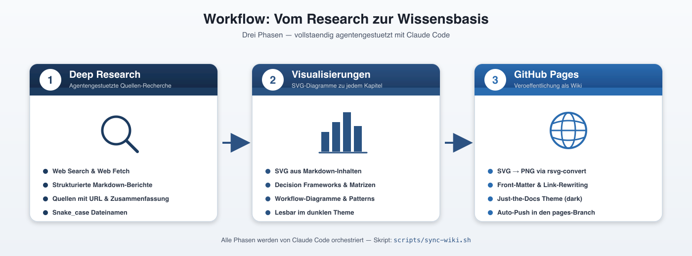

# Agentic Engineering Research

Dieses Wiki dokumentiert Prinzipien, Patterns und Best Practices fuer Agentic Engineering, Deep Researches zur COBOL-Migration mit AWS und zur GitHub Copilot CLI -- basierend auf einer agentengestuetzten Recherche von ueber **450 Quellen** (Stand: April 2026).

> **Hinweis zur Erstellung:** Saemtliche Inhalte dieses Wikis wurden vollstaendig agentengestuetzt mit **[Claude Code](https://claude.com/claude-code)** erstellt. Es handelt sich ausschliesslich um Ergebnisse einer Deep Research und ein **menschliches Review hat nicht stattgefunden**. Alle Aussagen, Empfehlungen und Quellenangaben sollten daher kritisch gegengeprueft werden, bevor sie in produktiven Kontexten verwendet werden.

---

## Workflow

Der gesamte Inhalt dieses Wikis entsteht in drei aufeinanderfolgenden, agentengestuetzten Phasen:

1. **Deep Research** &mdash; Ein Research-Agent recherchiert ein Thema systematisch ueber Web Search und Web Fetch, persistiert alle Quellen in `_quellen.md` und legt strukturierte Markdown-Berichte unter `agent_doc/<topic>/` ab.
2. **Visualisierungen** &mdash; Fuer jedes Kapitel werden SVG-Diagramme generiert (Decision Frameworks, Workflow-Diagramme, Vergleichsmatrizen, Architektur-Skizzen), die direkt in den Markdown-Dateien referenziert werden.
3. **GitHub Pages** &mdash; Der Claude Code Skill [`publish-research-to-pages`](https://github.com/deep2universe/agentic-engineering-research/blob/main/.claude/skills/publish-research-to-pages/SKILL.md) uebernimmt die komplette Publikation: Er erweitert [`scripts/sync-wiki.sh`](https://github.com/deep2universe/agentic-engineering-research/blob/main/scripts/sync-wiki.sh) um eine neue Sektion, konvertiert SVGs zu PNGs, ergaenzt Front-Matter, schreibt interne Links um, aktualisiert `index.md` und pusht das Ergebnis in den `pages`-Branch. Ein einziger Prompt wie `publiziere agent_doc/<topic>` reicht aus &mdash; vom Mapping der Quelldateien ueber den Dry-Run bis zum Force-Push laeuft alles agentengestuetzt.

Alle drei Phasen werden mit **Claude Code** orchestriert -- es gibt keinen manuellen Editier-Schritt zwischen Research und Veroeffentlichung.

---

## Agentic Engineering: Prinzipien und Patterns

Vollstaendiger Guide fuer Senior Developer und Senior Architekten.

| Nr. | Kapitel | Inhalt |
|-----|---------|--------|
| 00 | [Uebersicht](AEP-00-Uebersicht) | Guide Map, Kernaussagen |
| 01 | [Grundlagen und Definitionen](AEP-01-Grundlagen) | Was ist Agentic Engineering? Kernkonzepte, Abgrenzungen |
| 02 | [Architektur-Prinzipien](AEP-02-Architektur-Prinzipien) | Fundamentale Design-Prinzipien fuer Agent-Systeme |
| 03 | [Workflow Patterns](AEP-03-Workflow-Patterns) | Prompt Chaining, Routing, Parallelization, Orchestrator-Worker |
| 04 | [Reasoning und Planning](AEP-04-Reasoning-Planning-Patterns) | ReAct, Chain of Thought, Tree of Thought, Reflection |
| 05 | [Multi-Agent Patterns](AEP-05-Multi-Agent-Patterns) | Orchestrierung, Kommunikation, Delegation, Swarm |
| 06 | [Tool Use und Context Engineering](AEP-06-Tool-Use-Context-Engineering) | Function Calling, MCP, Memory, RAG |
| 07 | [Resilience und Error Handling](AEP-07-Resilience-Error-Handling) | Retry, Fallback, Circuit Breaker |
| 08 | [Safety, Security und Guardrails](AEP-08-Safety-Security-Guardrails) | Prompt Injection Defense, Sandboxing |
| 09 | [Human-in-the-Loop](AEP-09-Human-in-the-Loop) | Approval Workflows, Escalation |
| 10 | [Observability und Evaluation](AEP-10-Observability-Evaluation) | Tracing, Monitoring, Testing |
| 11 | [Frameworks und Implementierung](AEP-11-Frameworks-Implementierung) | LangGraph, CrewAI, AutoGen, Claude Code |
| 12 | [Agentic Coding Patterns](AEP-12-Agentic-Coding-Patterns) | Patterns fuer Coding Agents |
| -- | [Quellen](AEP-Quellen) | Alle Recherche-Quellen |

---

## Tool Use, Memory und RAG Patterns

Detailberichte zu Tool Use, Memory, RAG, Context Engineering und MCP.

| Kapitel | Inhalt |
|---------|--------|
| [Gesamtbericht](TUMR-Gesamtbericht) | Zusammenfassung aller Themen |
| [Tool Use Patterns](TUMR-Tool-Use-Patterns) | Function Calling, Tool Selection, Tool Chaining |
| [Memory Patterns](TUMR-Memory-Patterns) | Short-term, Long-term, Episodic, Semantic |
| [RAG Patterns](TUMR-RAG-Patterns) | RAG-Varianten und Agentic RAG |
| [Context Engineering](TUMR-Context-Engineering) | Context Management und Engineering |
| [MCP Patterns](TUMR-MCP-Patterns) | Model Context Protocol |
| [Quellen](TUMR-Quellen) | Alle Recherche-Quellen |

---

## Skills Zero to Hero

Vollstaendiger Guide zum Thema Skills im Agentic Engineering.

| Nr. | Kapitel | Inhalt |
|-----|---------|--------|
| 00 | [Uebersicht](SZH-00-Uebersicht) | Guide Map, Kernaussagen, Marktzahlen |
| 01 | [Grundlagen Skills](SZH-01-Grundlagen-Skills) | Was sind Skills? Definition, Abgrenzung |
| 02 | [Agent Skills Standard](SZH-02-Agent-Skills-Standard) | Offener Standard, Spezifikation, Adoption |
| 03 | [Skill Anatomie](SZH-03-Skill-Anatomie) | SKILL.md, Frontmatter, Verzeichnisstruktur |
| 04 | [Skill Prinzipien](SZH-04-Skill-Prinzipien) | Kernprinzipien, Conciseness, Progressive Disclosure |
| 05 | [Skill Patterns](SZH-05-Skill-Patterns) | Template, Workflow, Conditional, Composition |
| 06 | [Skill Planung und Erstellung](SZH-06-Skill-Planung-Erstellung) | Methodik, Evaluation-Driven Development |
| 07 | [Claude Code Skills](SZH-07-Claude-Code-Skills) | Bundled Skills, Custom Skills, Invocation |
| 08 | [Skill Oekosystem](SZH-08-Skill-Oekosystem) | MCP, Plattformen, Cross-Tool-Kompatibilitaet |
| 09 | [Advanced Patterns](SZH-09-Advanced-Patterns) | Dynamic Context Injection, Multi-Agent Skills |
| 10 | [Anti-Patterns](SZH-10-Anti-Patterns) | Haeufige Fehler, Security-Risiken |
| 11 | [Skill Landkarte](SZH-11-Skill-Landkarte) | Vollstaendige Wissenslandkarte |
| -- | [Quellen](SZH-Quellen) | Alle Recherche-Quellen |
| -- | [Best Practices Quellen](SZH-Best-Practices-Quellen) | Quellen zu Skill Design Best Practices |

---

## Skill-Systeme in AI Agent Frameworks

Vergleich der Skill- und Tool-Systeme von sieben fuehrenden Frameworks.

| Nr. | Kapitel | Inhalt |
|-----|---------|--------|
| 00 | [Uebersicht](SSF-00-Uebersicht) | Zusammenfassung, Erkenntnisse |
| 01 | [LangChain und LangGraph](SSF-01-LangChain-LangGraph) | Tools und Skills Architektur |
| 02 | [CrewAI](SSF-02-CrewAI) | Skills/Tools System |
| 03 | [AutoGPT und AutoGen](SSF-03-AutoGPT-AutoGen) | Components und Skills |
| 04 | [OpenAI Agents SDK](SSF-04-OpenAI-Agents-SDK) | Tool/Function Calling |
| 05 | [Claude Agent SDK](SSF-05-Claude-Agent-SDK) | SKILL.md Standard |
| 06 | [Semantic Kernel](SSF-06-Semantic-Kernel) | Skills/Plugins |
| 07 | [Amazon Bedrock Agents](SSF-07-Amazon-Bedrock-Agents) | Action Groups |
| 08 | [Vergleich und Best Practices](SSF-08-Vergleich-und-Best-Practices) | Vergleichsmatrix |
| -- | [Quellen](SSF-Quellen) | Alle Recherche-Quellen |

---

## COBOL Migration mit AWS

Deep Research zu COBOL- und Mainframe-Modernisierung mit Schwerpunkt AWS-Tooling (Stand: April 2026).

| Nr. | Kapitel | Inhalt |
|-----|---------|--------|
| 00 | [Guide und Decision Framework](CMA-00-Guide) | Executive Summary, Reading Guide, Decision Framework |
| 01 | [AWS Mainframe Modernization (M2)](CMA-01-AWS-Mainframe-Modernization) | Blu Age Refactoring, Rocket Replatforming, Service-Architektur |
| 02 | [AWS Transform Deep Dive](CMA-02-AWS-Transform) | Agentic AI fuer Modernisierung, Faehigkeiten, Preismodell |
| 03 | [AWS Migration Hub](CMA-03-AWS-Migration-Hub) | Discovery, Orchestrierung, Nachfolger-Strategie |
| 04 | [COBOL zu Java mit AWS](CMA-04-COBOL-zu-Java) | End-to-End Workflow ueber 8 Phasen |
| 05 | [Best Practices und Patterns](CMA-05-Best-Practices) | Migrationsstrategie, Testing, Top-Fallstricke, Goldene Regeln |
| 06 | [Weitere Tools (IBM, Google, Azure, ISVs)](CMA-06-Weitere-Tools) | Marktueberblick, Vergleichsmatrix, GenAI, Open Source |
| -- | [Quellen](CMA-Quellen) | Alle Recherche-Quellen |

---

## GitHub Copilot CLI

Deep Research zur GitHub Copilot CLI (`copilot`, GA Februar 2026): Coding Agent im Terminal mit REPL, Slash-Commands, Built-in-Tools, MCP, Subagenten und Headless-CI-Modus.

| Nr. | Kapitel | Inhalt |
|-----|---------|--------|
| 01 | [Feature Uebersicht](GCC-01-Feature-Uebersicht) | Vollstaendige Feature-Landkarte: REPL, CLI-Flags, Slash-Commands, Built-in Tools, Approval-Modi |
| 02 | [Installation und Setup](GCC-02-Installation-und-Setup) | Voraussetzungen, Authentifizierung, Konfiguration, Datenschutz, Smoketest |
| 03 | [Senior Developer Guide](GCC-03-Senior-Developer-Guide) | Mentales Modell, Reife-Stufen, taegliche Patterns, Top-10 fuer Architekten |
| 04 | [Agentic Engineering, MCP, Security](GCC-04-Agentic-MCP-Security) | Agentic Loop, MCP-Architektur, Tool-Approval, Sicherheitsmodell, Failure Modes |
| 05 | [Workflows und Vergleich](GCC-05-Workflows-und-Vergleich) | Typische Workflows, CI/CD-Automatisierung, Vergleichstabelle, Hidden Gems |
| 06 | [Cheat Sheet](GCC-06-Cheat-Sheet) | Druckreife Kurzreferenz: Slash-Commands, Keybindings, MCP-Config, 7 Sicherheits-Mantras |
| -- | [Quellen](GCC-Quellen) | Alle Recherche-Quellen |

---

## PL/I zu Java Migration

Deep Research zur Migration von PL/I-Anwendungen nach Java mit AWS-Tooling und Agentic Engineering (Stand: April 2026).

| Nr. | Kapitel | Inhalt |
|-----|---------|--------|
| 00 | [Hauptguide](PTJ-00-Hauptguide) | Executive Summary, Reading Guide, Onboarding Roadmap |
| 01 | [Sprachmerkmale und Konvertierung](PTJ-01-Sprachmerkmale) | PL/I-Features und deren Java-Mapping |
| 02 | [AWS Feature Uebersicht](PTJ-02-AWS-Features) | AWS-Services fuer PL/I-Migration |
| 03 | [Agentic Engineering Workflows](PTJ-03-Agentic-Workflows) | KI-gestuetzte Migrations-Pipelines |
| 04 | [50-Prozent-Szenarien](PTJ-04-50-Prozent-Szenarien) | Strategien fuer halb abgeschlossene Projekte |
| 05 | [Testabdeckung und Teststrategien](PTJ-05-Teststrategien) | Test-Pyramide, Dual-Run, Mutation Testing |
| 06 | [Best Practices](PTJ-06-Best-Practices) | Anti-Patterns, goldene Regeln, Security |
| 07 | [Erweiterter Loesungshorizont](PTJ-07-Loesungshorizont) | Alternativen jenseits von AWS, 7 Rs, Koexistenz |
| -- | [Quellen](PTJ-Quellen) | Alle Recherche-Quellen |

---

*Quellcode: [agent_doc/](https://github.com/deep2universe/agentic-engineering-research/tree/main/agent_doc) &mdash; Sync-Skript: [scripts/sync-wiki.sh](https://github.com/deep2universe/agentic-engineering-research/blob/main/scripts/sync-wiki.sh)*
